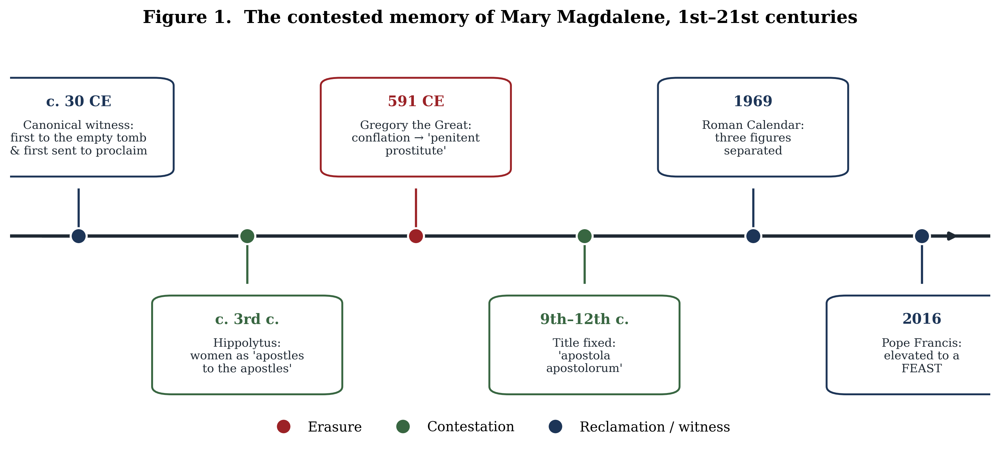
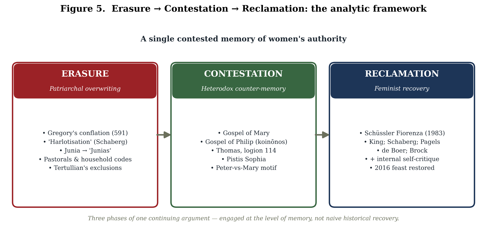
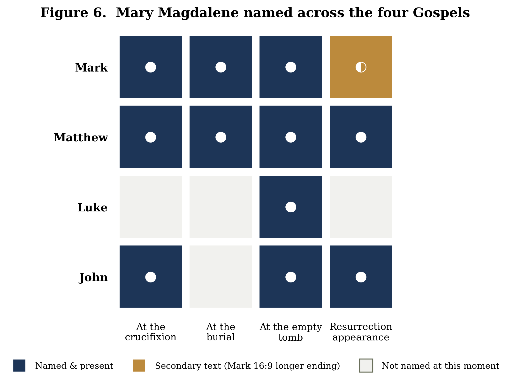
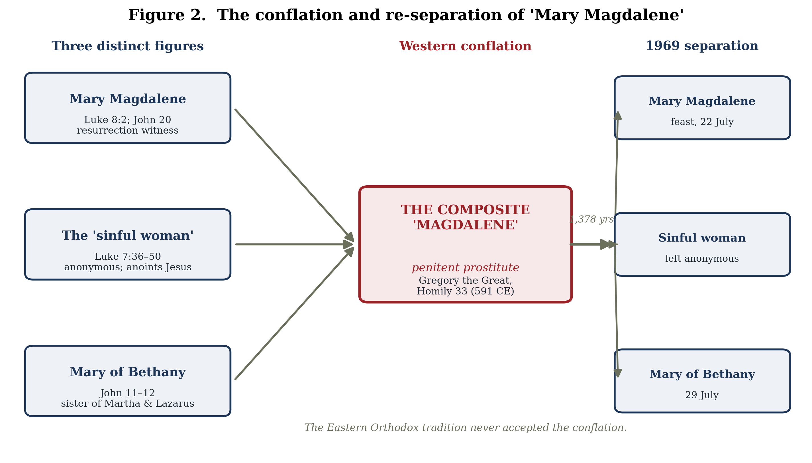
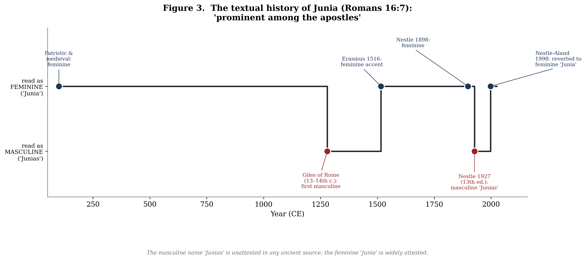
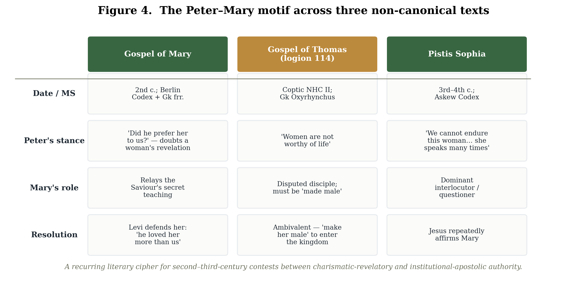
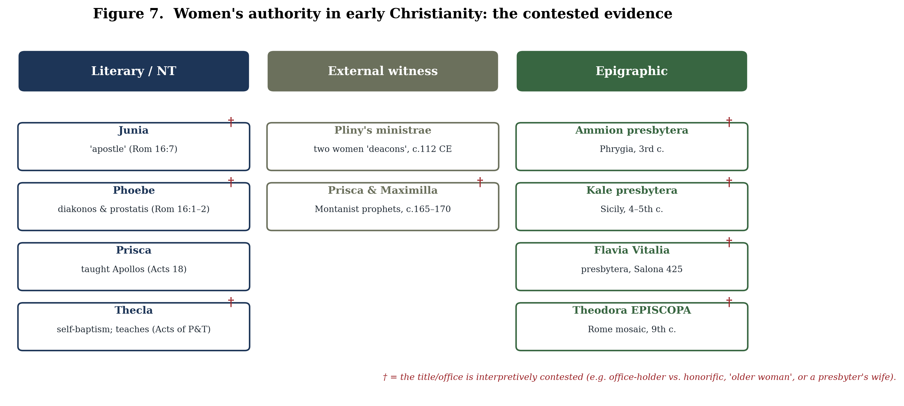

# Mary Magdalene and the Memory of Women's Authority in Early Christianity: Patriarchal Erasure, Heterodox Contestation, and Feminist Reclamation

## Abstract

Few figures in the Christian tradition have carried so much interpretive freight on so slender a textual base as Mary Magdalene. Named in all four canonical Gospels as a witness to the crucifixion, burial, and empty tomb, and presented in Matthew and John as the first witness to the resurrection and the first to be commissioned to proclaim it, she was honoured in patristic and medieval tradition as *apostola apostolorum*, "the apostle to the apostles." Yet for roughly fourteen centuries of Western Christianity she was remembered chiefly as a reformed prostitute—a portrait without foundation in the New Testament. This narrative review synthesises historical-critical, heresiological, and feminist scholarship to argue that Mary Magdalene functions as a privileged site of *cultural memory* in which contests over women's authority in early Christianity were waged, lost, and—latterly—reopened. The review is organised around three interlocking movements. First, **patriarchal erasure**: the conflation of Mary with the anonymous sinner of Luke 7 and Mary of Bethany, fixed by Pope Gregory the Great in 591 CE, alongside cognate processes such as the scribal masculinisation of the apostle Junia (Romans 16:7) and the deutero-Pauline silencing of women. Second, **heterodox contestation**: the prominence of Mary in non-canonical texts—the *Gospel of Mary*, the *Gospel of Philip*, the *Gospel of Thomas*, and *Pistis Sophia*—where a recurring Peter-versus-Mary motif dramatises struggles over the basis of legitimate authority. Third, **feminist reclamation**: the twentieth- and twenty-first-century recovery of Mary and of women's leadership more broadly, from Elisabeth Schüssler Fiorenza's "discipleship of equals" to Karen King's "first woman apostle." Throughout, the review foregrounds live scholarly disagreements—over the meaning of *koinōnos* in the *Gospel of Philip*, the very identity of the "Mary" of the heterodox texts, the coherence of "Gnosticism" as a category, and the danger of romanticising heterodox sources as proto-feminist—and argues that the most rigorous reclamation has emerged from feminist scholarship's own critical self-correction. The Magdalene tradition, it concludes, is best read not as a transparent window onto a historical woman but as a centuries-long argument, conducted in the medium of memory, about who may speak with authority in the name of the risen Christ.

**Keywords:** Mary Magdalene; women's leadership; early Christianity; cultural memory; feminist hermeneutics; Gospel of Mary; Gnosticism; reception history; apostolic authority; Elisabeth Schüssler Fiorenza

---

## 1. Introduction

The history of Mary Magdalene is, to an unusual degree, a history of what was done to her memory. The canonical data are sparse and remarkably consistent: she appears by name some twelve times across the four Gospels, almost always at the decisive hinge of the Passion and resurrection narratives, and almost always at the head of the lists of women who remained when the male disciples had fled (Mark 15:40, 15:47; Matthew 27:56, 27:61; Luke 24:10; John 19:25; 20:1–18). She is, on any reading of Matthew and John, the first witness to the empty tomb and the first to encounter the risen Jesus; in the Fourth Gospel she is explicitly sent—*apostellō*, the verb from which "apostle" is formed—to announce the resurrection to the male disciples (John 20:17–18). And yet, in the cultural memory of the Latin West, none of this is what she became. She became the penitent whore: the weeping woman with the alabaster jar and the loosened hair, the patron saint of the reformed prostitute, the very emblem of fallen and redeemed female sexuality.

The gap between the canonical Mary and the remembered Mary is the central problem this review addresses. It is not adequately described as a simple "mistake" later corrected, though it was in part that. It is better understood through the category of *cultural memory*: the socially organised, institutionally transmitted, and constantly renegotiated work by which a community decides what its past means and who within that past may count as an authority. The title of this review—and of the tradition it surveys—names three successive operations performed upon that memory. **Erasure** describes the long process, both deliberate and inadvertent, by which Mary's apostolic standing was overwritten by the figure of the penitent sinner, and by which women's leadership more generally was screened out of the normative record. **Contestation** describes the survival, in the non-canonical and heresiologically suspect literature, of a counter-memory in which Mary is the privileged interlocutor of the risen Christ and the rival of Peter. **Reclamation** describes the modern feminist project of recovering both Mary and the wider history of women's authority—a project that has had to reckon, with increasing sophistication, with the limits of its own sources.

The case for treating Mary Magdalene as a strategic site of memory has been made most influentially by Elisabeth Schüssler Fiorenza, whose *In Memory of Her* (1983) takes its very title from the saying of Jesus over the woman who anoints him at Bethany: "wherever the gospel is preached in the whole world, what she has done will be told in memory of her" (Mark 14:9). The irony Schüssler Fiorenza presses is that this woman, whose deed was to be remembered "wherever the gospel is preached," is left unnamed in Mark and Matthew, while the betrayer beside her is named; the promise of remembrance is, as she puts it, forgotten along with the woman's name. Mary Magdalene is the figure on whom that forgetting was, paradoxically, most lavishly inscribed—and around whom the labour of re-remembering has been most concentrated.

***Figure 1.*** *The contested memory of Mary Magdalene from the first to the twenty-first century, colour-coded by the three movements of erasure, contestation, and reclamation.*

This review proceeds as follows. Section 2 outlines the method and scope of the survey. Section 3 establishes the canonical and historical "raw material" of the memory—what the earliest sources do and do not say, and what historical-critical scholarship can responsibly reconstruct about the woman from Magdala. Section 4 examines patriarchal erasure, both in the specific case of Mary's "harlotisation" and in the cognate mechanisms—the Junia tradition, the Pastoral Epistles, the household codes—by which women's authority was constrained. Section 5 turns to the heterodox counter-tradition and the Peter-versus-Mary motif, while taking seriously the methodological cautions that now attend the terms "Gnostic" and even "Mary." Section 6 surveys the feminist reclamation and, crucially, the debates internal to it. Section 7 synthesises the broader epigraphic and documentary evidence for women officeholders, situating Mary within a wider, contested history. Section 8 concludes.

## 2. Method and scope

This is a narrative—rather than systematic—review, appropriate to a body of scholarship that is interpretive, cross-disciplinary, and irreducibly contested. It draws together five literatures that are too rarely read against one another: New Testament historical criticism; patristics and the history of biblical interpretation (*Wirkungsgeschichte*); the study of non-canonical and so-called "Gnostic" Christianity; feminist and gender-critical theology; and the epigraphic and documentary history of early Christian office. The aim is integrative and critical rather than exhaustive: to trace how a single figure became the lightning rod for a much larger argument about women's authority, and to adjudicate, where possible, between competing scholarly reconstructions.

***Figure 5.*** *The analytic framework: erasure, contestation, and reclamation as three phases of a single continuing argument about women's authority, engaged at the level of memory.*

Two methodological commitments structure what follows. The first is a principled distinction between *history* and *memory*. Much of the most influential writing on Mary Magdalene—Schaberg's "Magdalene Christianity," Pagels's "suppressed Gnostic feminism"—operates at the level of historical reconstruction, claiming to recover a suppressed past. A more cautious recent scholarship (D'Angelo, Brock, Shoemaker) insists that the figure of Mary in the sources is frequently a rhetorical cipher in disputes over authority rather than a transparent record of a historical woman. This review treats that tension not as an obstacle to be resolved but as itself the principal finding: the Magdalene tradition is most illuminating when read as a history of contested memory.

The second commitment is to flag disagreement rather than smooth it. At every stage—the meaning of *episēmoi en tois apostolois* in Romans 16:7, the lacuna in the *Gospel of Philip*, the identity of the "Mary" of the dialogue gospels, the coherence of "Gnosticism," the force of *Gospel of Thomas* logion 114, the etymology of "Magdalene" itself—the secondary literature is genuinely divided. These divisions are reported as such. Where a claim rests on the reconstruction of a single influential scholar, that provenance is named.

A note on sources is in order. The primary texts cited below—the canonical Gospels, the Nag Hammadi and Berlin Codex tractates, the patristic corpus, the conciliar canons, and the relevant inscriptions—are quoted from the standard critical and translation editions identified in the references, and exact wording (especially of the heterodox texts, which survive in lacunose and translation-dependent states) should always be checked against those editions, since English renderings vary materially.

## 3. The canonical and the historical Mary: memory's raw material

### 3.1 The Magdalene of the Gospels

Mary Magdalene is, after Jesus' mother, the most frequently named woman in the Gospels. The distribution of her appearances is itself significant: she is named at the crucifixion (Mark 15:40; Matthew 27:56; John 19:25), at the burial, where Mark specifies that she "saw where he was laid" (Mark 15:47; Matthew 27:61), and at the empty tomb in all four accounts (Mark 16:1; Matthew 28:1; Luke 24:10; John 20:1). In Matthew and John she is the first to encounter the risen Jesus, and the appended longer ending of Mark records that he "appeared first to Mary Magdalene" (Mark 16:9)—though this verse belongs to a secondary ending absent from the earliest manuscripts and cannot bear independent historical weight.

***Figure 6.*** *Mary Magdalene named across the four canonical Gospels at the crucifixion, burial, empty tomb, and resurrection appearance. The half-marker for Mark notes the secondary "longer ending" (Mark 16:9).*

It is the Johannine narrative that does most to establish her later honorific. In John 20:1–18 Mary alone discovers the empty tomb, alone encounters the risen Lord—whom she at first mistakes for the gardener—and is commissioned by him with the words "go to my brothers and say to them" (John 20:17). Her report, "I have seen the Lord" (John 20:18), makes her the first human being charged with proclaiming the resurrection. On the standard early-Christian criterion for apostleship—a resurrection appearance coupled with a commission to proclaim it—Mary Magdalene qualifies, a point to which the feminist reclamation would later return with force.

The Lukan portrait is at once the source of one persistent datum and, on the reconstruction of several scholars, the beginning of Mary's marginalisation. Luke 8:1–3 introduces her among women who travelled with Jesus and the Twelve and who "provided for them out of their own resources," indicating that these women were patrons—of independent means—rather than dependents. The same passage supplies the notice that seven demons "had gone out" of her (Luke 8:2). In its first-century context this denotes deliverance from severe affliction, physical or psychological, not moral or sexual sin; as one commentator puts it, the seven demons were "a sign of her misery, not her wickedness." How to read the number "seven" is disputed—Bart Ehrman takes it as symbolic of completeness (she was wholly overwhelmed), while Bruce Chilton suggests successive exorcisms—but no reading internal to Luke associates it with prostitution.

### 3.2 *Apostola apostolorum*: the honorific and its history

The title by which Mary Magdalene was known through much of the tradition—*apostola apostolorum*, "apostle to the apostles"—has a longer and more layered history than is often appreciated. Its conceptual root lies in the third century: Hippolytus of Rome (c. 170–235), in his *Commentary on the Song of Songs*, applies apostolic language to the women at the tomb, calling them "apostles to the apostles" sent by Christ, and adds the striking exclamation, "O new comfort! Eve becomes an apostle!"—though he applies the language to the women collectively rather than uniquely titling Mary. The fixed Latin title is a medieval coinage: it appears in the ninth-century *Life of Mary Magdalene* attributed to Rabanus Maurus and was popularised in the twelfth century by Bernard of Clairvaux and others, later passing to Thomas Aquinas. The precise dating is disputed—Darrell Bock locates the title in the tenth century, while Katherine Ludwig Jansen finds no attestation before the twelfth, by which point it was "commonplace"—but the trajectory is clear: a third-century intuition about the women's witness hardened, over some nine centuries, into a stable honorific.

### 3.3 The historical woman from Magdala

Historical-critical reconstruction of the "real" Mary Magdalene proceeds cautiously from this canonical base. The traditional reading takes "Magdalene" as a toponymic—"the woman from Magdala," a prosperous fishing town on the western shore of the Sea of Galilee, known in Aramaic as *Migdal Nunaiya* ("Tower of Fish") and to Josephus as *Tarichaea*, "the place of salting fish." Excavations begun in 2009 have confirmed Magdala as a thriving first-century town, uncovering a synagogue (the celebrated "Magdala Stone"), paved streets, a marketplace, ritual baths, and an industrial fish-processing complex. That Mary is identified by town rather than by husband or father—and that Luke lists her as a patron—has led Jane Schaberg and others to infer a woman of independent social and economic standing, the antithesis of the later penitent.

This consensus has recently been challenged. Elizabeth Schrader and Joan Taylor, in a 2021 study in the *Journal of Biblical Literature*, argue that "Magdalene" may be an honorific—"the Tower-ess," from the Hebrew/Aramaic *migdal*, "tower"—rather than a place of origin, noting that a town called simply "Magdala" is poorly attested in the earliest New Testament manuscripts and citing Jerome's description of Mary as a "tower" of faith. Taylor had earlier raised the problem of the "missing Magdala." The thesis is a prominent minority position and remains contested; the archaeologically grounded toponymic reading retains majority support. That the etymology of her very name is now in scholarly dispute is itself a fitting emblem of how thoroughly Mary Magdalene has become a contested memory rather than a settled fact.

## 4. Patriarchal erasure: from apostle to penitent

### 4.1 The conflation and the "harlotisation"

The single most consequential event in the Western memory of Mary Magdalene was a homily. In Homily 33 on the Gospels, delivered around 591 CE, Pope Gregory I ("the Great") fused three distinct figures into one: Mary Magdalene (Luke 8:2), the anonymous "sinful woman" who anoints Jesus' feet in Luke 7:36–50, and Mary of Bethany, sister of Martha and Lazarus (John 11–12). The operative sentence is preserved in the *Patrologia Latina*: "She whom Luke calls the sinful woman, whom John calls Mary [of Bethany], we believe to be the Mary from whom Mark says seven demons were cast out." Gregory then glossed the seven demons as "all the vices" (*universa vitia*) and read the woman's ointment as having previously perfumed her flesh "in forbidden acts," supplying the sexual charge that the text of Luke 7—which calls the woman only *hamartōlos*, "a sinner," with no mention of prostitution—does not contain.

***Figure 2.*** *The conflation of three distinct New Testament figures into the composite "penitent Magdalene" by Gregory the Great (591 CE), and their re-separation in the 1969 Roman Calendar. The Eastern Orthodox tradition never accepted the conflation.*

Two features of this act deserve emphasis. First, it was a specifically Western, Latin development: the Eastern Orthodox tradition never accepted the conflation and continued to commemorate Mary Magdalene, Mary of Bethany, and the sinful woman as three distinct persons. Second, its effects were extraordinarily durable. Susan Haskins, in *Mary Magdalen: Myth and Metaphor* (1993), traces across some two thousand years of sermons, devotional writing, and art how the composite Magdalene "came to epitomise the condition of women in the Church and in society," her transformation "from apostle to the apostles into the penitent whore" becoming one of the most productive image-complexes in Western culture.

Jane Schaberg gave this process its now-standard name. In *The Resurrection of Mary Magdalene* (2002) she analyses the centuries-long "harlotisation" by which a leading female disciple and resurrection witness was recast as a redeemed prostitute, and reconstructs—at the level of memory and counter-memory—a suppressed "Magdalene Christianity" in which Mary is portrayed as a successor to Jesus and a challenge to Petrine primacy. Schaberg's method is itself notable: she pairs the Magdalene materials with Virginia Woolf's meditations on a lost female intellectual tradition to develop what she calls a feminist resurrection hermeneutic. The reconstruction of "Magdalene Christianity" as a historical entity is contested and single-authored; the description of the harlotisation as an ideological operation upon memory is widely accepted.

That the operation was, in principle, reversible the modern Roman Catholic Church itself eventually conceded. The 1969 revision of the General Roman Calendar under Paul VI quietly separated the three figures, clarifying that the 22 July commemoration concerns "only Saint Mary Magdalene, to whom Christ appeared after his resurrection," and not the sinful woman or Mary of Bethany—though, as careful commentators note, this corrected the liturgical *identification* rather than issuing a doctrinal pronouncement about prostitution. Nearly 1,400 years separated Gregory's homily from this correction. In 2016, at the express wish of Pope Francis, the Congregation for Divine Worship elevated her 22 July memorial to a *feast*—the same rank accorded the apostles—with an accompanying article by Archbishop Arthur Roche titled *Apostolorum Apostola*, and with the explicit rationale that "it is right that the liturgical celebration of this woman should have the same grade of feast given to the celebration of the Apostles." The institution that had remembered her as a whore now, formally, remembered her as the apostle to the apostles.

### 4.2 The mechanics of erasure: Peter, Luke, and the politics of "apostle"

If the harlotisation is the most visible instrument of erasure, it is not the only one, and arguably not the earliest. Ann Graham Brock, in *Mary Magdalene, the First Apostle: The Struggle for Authority* (Harvard Theological Studies, 2003), argues that the conferral and withholding of the title "apostle" functioned as a tool of persuasion in early Christian politics. Reading across the canonical and non-canonical literature, Brock identifies a striking inverse correlation: where Peter is prominent, Mary's leadership is diminished or absent; where Mary is prominent, Peter recedes. The pattern, she argues, is not accidental but reflects competing claims to authority advanced through the medium of these foundational figures.

The Gospel of Luke is, on Brock's analysis, the most "pro-Peter" and pro-hierarchical of the canonical Gospels. It promotes the narrowest and most formal concept of apostleship, and it is alone among the four in having the risen Lord appear first to Peter—"The Lord has risen indeed, and has appeared to Simon!" (Luke 24:34)—while omitting any resurrection appearance to Mary Magdalene. This parallels the pre-Pauline creedal formula of 1 Corinthians 15:5, "he appeared to Cephas, then to the twelve," which likewise passes over the women whom the Gospel narratives place first at the tomb. The textual facts are not in dispute; the interpretive weight Brock places on them—as evidence of a deliberate elevation of Petrine over Magdalene authority—is her contribution to a now-influential reading.

### 4.3 The erasure of Junia

The clearest documented case of the literal erasure of a woman's apostolic standing is not Mary's but that of Junia. In Romans 16:7 Paul greets "Andronicus and Junia … who are prominent among the apostles." Eldon Jay Epp's *Junia: The First Woman Apostle* (2005) marshals the evidence that the feminine name *Junia* was common in the Greco-Roman world—attested, by Epp's count, hundreds of times—while the masculine *Junias* is unattested in any ancient literary text, inscription, or papyrus. Patristic and medieval commentators read the name as feminine without exception until the thirteenth century; John Chrysostom, in his *Homily 31 on Romans*, exclaimed, "how great the wisdom of this woman must have been, that she was even counted worthy of the title of apostle." The first named writer to read the name as masculine appears to have been Giles of Rome in the thirteenth–fourteenth century.

***Figure 3.*** *The textual history of Junia (Romans 16:7): read as feminine by patristic and medieval commentators, masculinised to "Junias" in the Nestle text of 1927, and reverted to the feminine "Junia" by Nestle-Aland in 1998.*

The mechanics of the modern erasure are precisely documented. Because the earliest manuscripts lacked accents, the accusative form *IOYNIAN* is orthographically ambiguous. The Nestle Greek New Testament printed the feminine "Junia" from 1898 until its thirteenth edition of 1927, when—without new manuscript evidence—the editors switched to the masculine "Junias," a reading retained for some seventy-one years until the Nestle-Aland text reverted to "Junia" in 1998. Two scholarly disagreements attend this history and should be flagged. The first concerns Romans 16:7 itself: whether *episēmoi en tois apostolois* means "prominent among the apostles" (so that Junia is herself an apostle—Epp, Bauckham) or "well known to the apostles" (so that she is not—Burer and Wallace). The second concerns motive: Epp implies ideological suppression, whereas some textual critics attribute the 1927 change to an unexamined grammatical assumption that the name must be a contracted masculine form. The *fact* of the change, and the non-attestation of "Junias," are not in dispute; the female apostle was, for the better part of a century, edited out of the standard scholarly text.

### 4.4 The deutero-Pauline constraint and the household codes

The erasure of individual women is set against a broader textual movement that a majority of critical scholars locate in the post-Pauline generations. The Pastoral Epistles, including 1 Timothy, are widely regarded as deutero-Pauline: over a third of their vocabulary is absent from the undisputed letters, with meanings more consistent with second-century usage (though Pauline authorship is still defended on confessional grounds). It is in this stratum that the sharpest restrictions appear. 1 Timothy 2:11–12 enjoins, "Let a woman learn in silence with full submission. I permit no woman to teach or to have authority over a man; she is to keep silent," grounding the prohibition in the creation order and Eve's deception—the principal proof-text in later debates over women's ordination.

A related and much-debated case is 1 Corinthians 14:34–35, "women should be silent in the churches." Many scholars since the nineteenth century, notably Gordon Fee and Philip B. Payne, regard these verses as a non-Pauline interpolation: they interrupt the argument from verse 33 to verse 36, contain un-Pauline vocabulary, contradict 1 Corinthians 11:5 (where women pray and prophesy aloud), and "float" to a different position after verse 40 in part of the Western manuscript tradition. The debate is genuinely unresolved—no extant manuscript omits the verses entirely, which weakens the interpolation hypothesis—and alternative readings (a quotation Paul then refutes; a narrowly limited prohibition) remain in play. The passage is best presented as contested rather than settled.

Finally, the *Haustafeln* or household codes (Colossians 3:18–4:1; Ephesians 5:21–6:9; 1 Peter 2:13–3:7) adapt the Greco-Roman tradition of household management, with its paired instructions for husbands and wives, masters and slaves, parents and children, and enjoin the subordination of wives—even as Ephesians frames its code with the reciprocal "be subject to one another" (5:21). Whether the codes represent an accommodation to surrounding patriarchy or a transformative softening of it is itself contested between egalitarian and complementarian readings. For Elisabeth Schüssler Fiorenza, the cumulative effect of this stratum is unmistakable: the charismatic "discipleship of equals" of the earliest movement was progressively supplanted, across the second and third centuries, by a hierarchical and patriarchal ecclesial order—a "patriarchalisation" visible in the very formation of the canon amid disputes over women's leadership.

### 4.5 Patristic rhetoric: Tertullian

The constraint had its rhetoricians. Tertullian, writing around 200 CE, universalised Eve's guilt to all women in a celebrated apostrophe in *De cultu feminarum*: "You are the devil's gateway … you are the first deserter of the divine law … on account of your desert—that is, death—even the Son of God had to die." In *De virginibus velandis* he drew the institutional conclusion: "It is not permitted to a woman to speak in the church; but neither is it permitted her to teach, nor to baptise, nor to offer, nor to claim to herself a lot in any manly function, not to say in any sacerdotal office." Some recent scholarship argues that the "devil's gateway" passage is ascetic and rhetorical rather than a systematic misogyny, a nuance worth preserving for balance; but the institutional exclusions Tertullian articulates are explicit and consequential.

## 5. Heterodox contestation: Mary in the non-canonical literature

### 5.1 The counter-memory and its rediscovery

Against this trajectory of constraint, a strikingly different memory of Mary Magdalene survived in the literature that the emerging orthodoxy branded heretical. The recovery of that literature is a modern story. The Berlin Codex (Papyrus Berolinensis 8502), containing the *Gospel of Mary*, was purchased in Cairo in 1896 but—delayed by two world wars—was not published until 1955. The transformative find came in December 1945 near Nag Hammadi in Upper Egypt, where a sealed jar yielded thirteen leather-bound papyrus codices preserving fifty-two tractates in Coptic. For the first time, scholars could read the so-called heterodox Christianities in their own voice rather than through the hostile summaries of the heresiologists, and the cumulative effect was to force a recognition that earliest Christianity was far more diverse than the later orthodox narrative allowed.

This recognition had been anticipated theoretically by Walter Bauer, whose *Orthodoxy and Heresy in Earliest Christianity* (1934; English translation 1971) argued that in many regions what was later condemned as heresy had been the earliest and locally dominant form of Christianity, and that "orthodoxy" and "heresy" should not be equated with an original majority and a later deviation. The Bauer thesis remains influential and heavily debated, with critics faulting its overgeneralisation from limited regional evidence. Its relevance here is methodological: it licenses reading the heterodox Mary not as a late aberration but as a witness to a genuine early-Christian alternative.

### 5.2 The *Gospel of Mary*

The *Gospel of Mary* is the only early Christian gospel attributed to a woman. Composed in Greek, probably in the first half of the second century, it survives in a fragmentary fifth-century Coptic copy (the Berlin Codex) supplemented by two third-century Greek fragments, Papyrus Rylands 463 and Papyrus Oxyrhynchus 3525. Roughly half the text is lost—pages 1–6 and 11–14 of the Coptic codex are missing—so that the surviving narrative opens in the middle of a post-resurrection dialogue. After the risen Saviour departs and the disciples are left fearful, Mary comforts them and relays a private teaching she has received concerning the soul's ascent past the hostile cosmic powers.

***Figure 4.*** *The Peter–Mary motif across the* Gospel of Mary, Gospel of Thomas *(logion 114), and* Pistis Sophia *— a recurring cipher for contests between charismatic-revelatory and institutional-apostolic authority.*

The decisive scene follows. When Mary has finished, Andrew and then Peter dispute the authenticity of her revelation, and Levi rises to her defence. In Karen King's translation, Peter objects: "Did he really speak with a woman without our knowing about it? Are we to turn around and all listen to her? Did he prefer her to us?" Levi replies: "Peter, you have always been hot-tempered … If the Saviour made her worthy, who are you to reject her? Surely the Saviour knew her very well. That is why he loved her more than us." King, in *The Gospel of Mary of Magdala: Jesus and the First Woman Apostle* (2003), reads the text as documenting a concrete intra-Christian conflict in which apostolic authority is made a function of spiritual insight rather than of gender or office, and Peter functions as the spokesman for an institutional, male-hierarchical conception of authority that the text means to relativise. This Peter-versus-Mary motif, repeated across several texts, is widely read as a literary cipher for the second- and third-century contest between charismatic-revelatory and apostolic-institutional models of legitimacy.

### 5.3 The *Gospel of Philip* and the problem of the lacuna

No single passage in this literature has been more sensationalised, or more misreported, than the description of Mary in the *Gospel of Philip*, a Valentinian compilation preserved in Nag Hammadi Codex II. The text calls Mary Magdalene the *koinōnos* (κοινωνός) of the Saviour—a term meaning "companion," "partner," or "associate," denoting one engaged in fellowship or sharing, where what is shared "can take many forms." The famous passage continues, in a badly damaged state: "And the companion of the [Saviour is] Mary Magdalene. [Christ loved] her more than [all] the disciples, and used to kiss her [often] on her […]." The final word is lost in a lacuna. Wesley Isenberg's widely reproduced English translation supplies "mouth," but this is an editorial reconstruction, not a manuscript reading; other proposals include cheek, forehead, hand, or feet. It is a basic and frequently violated principle of responsible scholarship that the text reads "kiss her on her ——," with the object missing.

The interpretation of the passage is correspondingly contested. Within the logic of the *Gospel of Philip*, several scholars argue, the kiss is a metaphor for the spiritual transmission of grace or *logos*—the text elsewhere treats kissing as the means by which "the perfect conceive and give birth"—rather than an erotic or marital datum. Bart Ehrman and others caution explicitly against reading the passage as evidence of a marriage between Jesus and Mary. The *koinōnos* designation establishes Mary's privileged closeness to the Saviour; it does not, on the best scholarship, establish the conjugal relationship of popular imagination.

### 5.4 The *Gospel of Thomas* and the ambivalence of the tradition

The *Gospel of Thomas*—preserved complete in Coptic in Nag Hammadi Codex II and partially in three earlier Greek Oxyrhynchus fragments, with its date of composition disputed across a wide range from the mid-first to the mid-second century—supplies the single most important caution against any simple reading of the heterodox tradition as pro-woman. Its closing saying, logion 114, runs:

> Simon Peter said to them, "Let Mary leave us, for women are not worthy of life." Jesus said, "I myself shall lead her in order to make her male, so that she too may become a living spirit resembling you males. For every woman who will make herself male will enter the kingdom of heaven."

Here the Peter-versus-Mary motif recurs, but the resolution is profoundly ambivalent. Interpretations diverge sharply: some read "make her male" as a metaphor for ascetic or spiritual transformation toward a primordial, undifferentiated unity; others as a non-dualist claim that the true spirit transcends gendered form; others again as a straightforwardly androcentric ideal that encodes female spiritual deficiency. Feminist readings are themselves divided, some finding the logion restorative (Mary is *included*, on equal footing) and others finding it misogynistic. The passage is a salutary warning: the very corpus often invoked to elevate Mary can, in the same breath, predicate her salvation on becoming "male."

### 5.5 *Pistis Sophia* and the dialogue gospels

The third-to-fourth-century *Pistis Sophia*, preserved in the Askew Codex (British Library Add. MS 5114), gives Mary Magdalene a position of unrivalled prominence: she is by far the dominant interlocutor, posing the great majority of the questions put to the risen Christ (the precise counts vary by section and edition and should be cited to a specific edition such as Schmidt–MacDermot). The text also preserves, in the mouth of Peter, the resentment this prominence provokes: "My Lord, we cannot endure this woman who gets in the way and does not let any of us speak, but she speaks many times." Mary, for her part, confesses that she is "afraid of Peter, because he threatens me and hates our race." Jesus repeatedly affirms her. The same configuration—Mary as the privileged recipient of revelation, her authority resented and contested—recurs across the *Dialogue of the Savior*, where she is praised as "the woman who knew the All," the *Sophia of Jesus Christ*, and the *(First) Apocalypse of James*.

### 5.6 Two indispensable cautions: "Mary" and "Gnosticism"

Two methodological cautions must temper any use of this material, and the most rigorous recent scholarship insists on both.

The first concerns the identity of "Mary." The texts frequently name only "Mary," "Mariam," or "Mariamne," and the identification of this figure with Mary Magdalene, rather than with Mary of Nazareth, has been challenged. Stephen J. Shoemaker, in a 2001 study in the *Journal of Early Christian Studies* and subsequently in *Mary in Early Christian Faith and Devotion* (2016), argues that the standard identification rests on "evidence that is at best inconclusive" and that Mary of Nazareth is an equally plausible referent in several texts. Shoemaker's is a minority but influential position; most specialists (King, Marjanen, de Boer) continue to read the dialogue-gospel "Mary" as the Magdalene. The point for a careful review is that the identification is an interpretive default, not a given.

The second concerns "Gnosticism" itself. Two major studies of 2003 converge on the conclusion that the category is a modern scholarly artefact. Michael Allen Williams, in *Rethinking "Gnosticism": An Argument for Dismantling a Dubious Category* (1996), argues that the phenomena lumped under the term are so internally diverse that the category should be abandoned. Karen King, in *What Is Gnosticism?* (2003), argues that "Gnosticism" never named an identifiable ancient religion but is "a rhetorical artefact"—a reification of the heresiological rhetoric by which the early orthodox defined themselves against their rivals—and must be disentangled from historiography. The consequence for the present subject is sharp and, as the next section shows, was drawn by feminist scholars themselves: if "Gnosticism" is not a coherent counter-church, then the *Gospel of Mary* and its companions cannot be cited as evidence of a unified, suppressed "feminist" Christianity.

## 6. Feminist reclamation—and its self-correction

### 6.1 The founding reconstruction: Schüssler Fiorenza

The modern feminist recovery of Mary Magdalene and of women's authority in early Christianity has a foundational text in Elisabeth Schüssler Fiorenza's *In Memory of Her: A Feminist Theological Reconstruction of Christian Origins* (1983). Its central historical claim is that the earliest Jesus movement constituted a "discipleship of equals"—a charismatic, egalitarian community in which women exercised genuine leadership—and that this ethos was progressively suppressed by the hierarchical, patriarchal structures of the post-apostolic church. Methodologically, the book offered the first comprehensive articulation of a feminist critical hermeneutic, pairing a *hermeneutics of suspicion* (which interrogates the androcentric character of the biblical texts and their transmission) with a *hermeneutics of remembrance* (which reconstructs the "hints and traces" of women's agency that those texts obscure). Schüssler Fiorenza's later work added further moments—proclamation, imagination, ritualisation—so that the often-cited "three-fold" typology of feminist interpretation is better described as a flexible family of strategies than a fixed enumeration. Her coinages—the "ekklesia of wo/men," with its deliberately fractured spelling marking "women" as an unstable category that also embraces other marginalised persons—became part of the field's basic vocabulary. Crucially, she had already, in a 1974 essay, named Mary Magdalene "apostle to the apostles" and made her erased witness emblematic of the larger forgetting her book set out to redress.

### 6.2 King, Schaberg, Pagels: the recovery of the Magdalene

Building on this foundation, a cluster of studies made Mary Magdalene specifically central. Karen King's *The Gospel of Mary of Magdala* (2003) presented the figure as a model of women's apostolic and spiritual authority, while insisting—against the popular tradition—that the "repentant prostitute" portrait is "a piece of theological fiction" without New Testament basis. Jane Schaberg's *The Resurrection of Mary Magdalene* (2002) reconstructed "Magdalene Christianity" as a counter-tradition to Petrine primacy. And, earliest and most influentially for the wider public, Elaine Pagels's *The Gnostic Gospels* (1979) advanced the thesis that attitudes toward women tracked the orthodox/heterodox divide: many "Gnostic" Christians, she argued, described God in both masculine and feminine terms and accorded women roles as prophets, teachers, and perhaps priests and bishops, whereas the orthodox churches, by around 200 CE, described God in exclusively masculine terms and excluded women from such roles. Pagels further speculated that this exclusion served in part as a *boundary-marker* against heresy—because the heretics included women, excluding them became a mode of orthodox self-differentiation.

### 6.3 The internal critique: against romanticising the heterodox

What distinguishes the most rigorous strand of this scholarship is that its sharpest correction has come from within. The Pagels-era reading—heterodox Christianity as a suppressed proto-feminism—has been substantially qualified, and largely by feminist scholars themselves.

Three lines of internal critique converge. First, the dismantling of "Gnosticism": King's own *What Is Gnosticism?* and Esther de Boer's *The Gospel of Mary: Beyond a Gnostic and a Biblical Mary Magdalene* (2004) deny that there ever was a coherent "Gnostic" counter-church whose esteem for Mary could be cited as a unified alternative. De Boer argues that the *Gospel of Mary*'s thought-world is in fact closer to Philo, Paul, and John than to the Nag Hammadi corpus, so that Mary's high standing reflects a broad early-Christian milieu rather than a sectarian "Gnostic" cult of Mary. Second, the ambivalence of the sources themselves: *Gospel of Thomas* logion 114, with its demand that Mary be "made male," has been read by some recent scholarship as a caution that the heterodox texts encode their own androcentrism, and at least one study argues that feminist enthusiasm has over-read Mary's prominence in Thomas. King herself, as editor of *Images of the Feminine in Gnosticism* (1988), had already framed the critical question—whether feminine *imagery* (goddesses, female saviours) corresponds to real women's *leadership*—rather than assuming that such imagery is inherently pro-woman. Third, the historiographical caution: Mary Rose D'Angelo's "Reconstructing 'Real' Women from Gospel Literature" (1999) and Brock's rhetorical analysis both insist that "Mary Magdalene" in these texts is frequently a cipher in disputes over authority rather than a transparent record of a historical woman.

These internal critiques are reinforced from outside by Philip Jenkins's *Hidden Gospels* (2001), which argues that the appeal of "Gnostic feminism" owes much to contemporary academic fashion, media sensationalism, and publishers' incentives, and notes that the non-canonical gospels were generally composed later than the canonical ones. Jenkins's polemic is itself contested; but its central methodological point—that the antiquity and representativeness of the heterodox texts cannot simply be assumed—has been substantially absorbed. It is worth stressing, against any framing of this debate as feminism versus its conservative critics, that the decisive corrections (King on "Gnosticism," de Boer on classification, D'Angelo on method) are feminist self-corrections. The mature reclamation is not a romance of a lost matriarchy but a disciplined argument about memory, conducted with full awareness of its evidentiary limits.

### 6.4 The wider hermeneutical movement and the "memory" frame

Mary Magdalene's reclamation belongs to a larger movement in feminist biblical hermeneutics. Phyllis Trible's *Texts of Terror* (1984) read four narratives of female suffering "in memoriam," combining literary criticism with a feminist confrontation of biblical misogyny; Antoinette Clark Wire's *The Corinthian Women Prophets* (1990) reconstructed an active circle of women prophets at Corinth by reading against the grain of Paul's rhetoric. The shared methodological wager—that women's agency can be recovered from androcentric texts by reading their silences and their polemics symptomatically—is precisely the wager that the historiographical critics question. It is also what makes the *memory* frame so apt: the object of study is less a recoverable set of historical women than the traces of a struggle over who would be remembered, and how.

Reception history confirms the point. The popular afterlife of Mary Magdalene—from the medieval penitent to Dan Brown's *The Da Vinci Code* (2003), which revived the legend of a married Magdalene destined to lead the church—demonstrates the figure's enduring availability as a screen for successive projections. Historians including Bart Ehrman (*Truth and Fiction in The Da Vinci Code*, 2004) and Darrell Bock have rebutted the marriage legend—"not a single one of our ancient sources indicates that Jesus was married, let alone married to Mary Magdalene," Ehrman observes—and traced the bloodline myth to twentieth-century forgeries later recanted by their author. That the scholarly community has had to expend such effort correcting a novel is itself evidence of how thoroughly Mary Magdalene remains a contested site of cultural memory.

## 7. Mary Magdalene in context: the wider record of women's authority

Mary Magdalene's significance is amplified when she is set within the broader, and likewise contested, record of women's leadership in the first Christian centuries. The New Testament names a striking number of women as co-workers, patrons, and leaders: alongside Junia the apostle and Phoebe—called both *diakonos* of the church at Cenchreae and *prostatis*, "patron" or "benefactor," of many (Romans 16:1–2), and the probable bearer of Paul's letter to Rome—stand Prisca, who instructed the evangelist Apollos and is named before her husband Aquila in four of six references (Acts 18:24–26); Lydia, Nympha, Chloe, Apphia, and the co-workers Euodia and Syntyche, who "laboured side by side" with Paul "in the gospel" (Philippians 4:2–3). Whether *diakonos* and *prostatis* denote formal office or general service is contested along confessional lines, but the density of named women in the earliest stratum is not.

External and material evidence corroborates a real, and contested, female presence in early Christian leadership. Pliny the Younger, governing Bithynia-Pontus around 112 CE, reports torturing two enslaved women "who were called *ministrae*"—the Latin equivalent of the Greek *diakonoi*, "deacons" (*Letters* 10.96.8). The "New Prophecy" or Montanism, arising in Phrygia around 165–170 CE, elevated two women, Prisca and Maximilla, as authoritative prophets; an oracle of Maximilla preserved by the hostile Epiphanius declares, "After me there will be no more prophetess, but the end." The widely circulated *Acts of Paul and Thecla* depicts Thecla baptising herself and being commissioned to "go and teach the word of God"; though the text is legendary rather than biographical, Tertullian's attack on those who invoked "the example of Thecla" to "defend the liberty of women to teach and to baptise" (*De baptismo* 17) is credible evidence that some Christians did exactly that.

***Figure 7.*** *The contested evidence for women's authority in early Christianity, across literary, external-pagan, and epigraphic witnesses. The dagger (†) marks data points whose title or office is interpretively disputed.*

The epigraphic record, systematically assembled by Ute Eisen (*Women Officeholders in Early Christianity*, 2000) and Kevin Madigan and Carolyn Osiek (*Ordained Women in the Early Church*, 2005), attests Christian women as deacons, presbyters, and even, in one famous case, an *episcopa*. A third-century Phrygian tombstone names "Ammion the presbytera"; a Sicilian inscription commemorates "the presbyter Kale … who lived fifty years without reproach"; a Dalmatian inscription of 425 records "Flavia Vitalia, presbytera," selling a grave plot; and a ninth-century mosaic in the church of Santa Prassede in Rome labels Pope Paschal I's mother "THEODORA EPISCOPA," her square halo marking her as living at the time. In the Byzantine East, women deacons were ordained with a laying-on-of-hands rite at the altar closely modelled on that for male deacons, as the *Apostolic Constitutions* and the eighth-century Barberini euchologion attest, and the Council of Chalcedon (451) set a minimum age for the office.

Each of these data points is contested—whether *presbytera* denotes an office-holder or merely "an older woman" or "a presbyter's wife"; whether *episcopa* names a female bishop or honours a bishop's mother; whether the *cheirotonia* of deaconesses constituted sacramental ordination equivalent to men's; and the apparent later defacement of the Theodora inscription's final letters has itself been read as evidence of discomfort with a female *episcopa*. But the cumulative weight is considerable, and it converges with the trajectory traced in this review. The fourth-century canonical record shows authority being actively withdrawn: the Synod of Laodicea (c. 363–364) forbade the appointment of "*presbytides* … or female presidents," and—as Schüssler Fiorenza, Eisen, and others observe—the very existence of a prohibition implies a prior practice substantial enough to require suppression. Whether the canons suppressed a robust earlier reality or merely regulated marginal local practice is debated; but on either reading, the institutional memory of women's authority was being curtailed precisely as it was being committed to writing.

## 8. Conclusion

Mary Magdalene is, in the end, less a woman about whom we know a great deal than a memory over which a great deal has been contested. The canonical sources give us a patron and disciple from a prosperous Galilean town, a witness to the crucifixion and burial, the first to the empty tomb, and—in Matthew and John—the first to see and to be sent by the risen Christ. Almost everything else is the history of what later generations did with that memory: the third-century intuition that the women at the tomb were "apostles to the apostles"; the sixth-century homily that fused Mary with the penitent sinner and held her in that figure for fourteen hundred years; the heterodox counter-memory in which she bested Peter as the recipient of the Saviour's deepest teaching; the modern recovery that named her, once more, the apostle to the apostles, until the institution that had remembered her as a whore enrolled her, in 2016, among the apostles in its calendar.

The three movements named in this review's title are therefore not three topics but three phases of a single, continuing argument about the legitimacy of women's authority in the name of Christ. Erasure, contestation, and reclamation are the names of what successive communities did to a memory they could neither fully suppress nor fully control. The most important methodological lesson of the recent scholarship is that this argument is best engaged at the level of memory rather than of naive historical recovery: the figure of Mary in both the canonical and the heterodox sources is, repeatedly, a cipher through which claims to authority were advanced, and the surest sign of the maturity of the feminist reclamation is that its own leading practitioners have said so. The heterodox texts cannot be enlisted as the charter of a lost feminist church; "Gnosticism" was not a coherent counter-tradition; even the "Mary" of the dialogue gospels may not always be the Magdalene; and the very name "Magdalene" is now in dispute. What survives all these qualifications is the central, well-attested fact around which the whole tradition turns: that a woman was remembered as the first witness to the resurrection and the first to be sent to proclaim it, and that the long subsequent effort to manage, diminish, and finally to restore that memory is itself one of the most revealing records we possess of the place of women's authority in the formation of Christianity. The memory of Mary Magdalene is, in the most precise sense, the memory of an argument that is not yet over.

---

## References

Bauckham, R. (2002) *Gospel Women: Studies of the Named Women in the Gospels*. Grand Rapids, MI: Eerdmans.

Bauer, W. (1971) *Orthodoxy and Heresy in Earliest Christianity*. Translated by the Philadelphia Seminar on Christian Origins. Philadelphia: Fortress Press. (German original *Rechtgläubigkeit und Ketzerei im ältesten Christentum*, 1934.)

Bock, D.L. (2004) *Breaking the Da Vinci Code: Answers to the Questions Everyone's Asking*. Nashville, TN: Thomas Nelson.

Brock, A.G. (2003) *Mary Magdalene, the First Apostle: The Struggle for Authority*. Harvard Theological Studies 51. Cambridge, MA: Harvard University Press.

Burer, M.H. and Wallace, D.B. (2001) 'Was Junia Really an Apostle? A Re-examination of Romans 16.7', *New Testament Studies*, 47(1), pp. 76–91.

Chilton, B. (2005) *Mary Magdalene: A Biography*. New York: Doubleday.

D'Angelo, M.R. (1999) 'Reconstructing "Real" Women from Gospel Literature: The Case of Mary Magdalene', in Kraemer, R.S. and D'Angelo, M.R. (eds.) *Women & Christian Origins*. New York: Oxford University Press, pp. 105–128.

de Boer, E.A. (1997) *Mary Magdalene: Beyond the Myth*. Translated by J. Bowden. Harrisburg, PA: Trinity Press International.

de Boer, E.A. (2004) *The Gospel of Mary: Beyond a Gnostic and a Biblical Mary Magdalene*. Journal for the Study of the New Testament Supplement Series 260. London: T&T Clark.

Ehrman, B.D. (2004) *Truth and Fiction in The Da Vinci Code: A Historian Reveals What We Really Know about Jesus, Mary Magdalene, and Constantine*. New York: Oxford University Press.

Ehrman, B.D. (2006) *Peter, Paul, and Mary Magdalene: The Followers of Jesus in History and Legend*. New York: Oxford University Press.

Eisen, U.E. (2000) *Women Officeholders in Early Christianity: Epigraphical and Literary Studies*. Translated by L.M. Maloney. Collegeville, MN: Liturgical Press.

Epp, E.J. (2005) *Junia: The First Woman Apostle*. Minneapolis, MN: Fortress Press.

Fee, G.D. (1987) *The First Epistle to the Corinthians*. New International Commentary on the New Testament. Grand Rapids, MI: Eerdmans.

Haskins, S. (1993) *Mary Magdalen: Myth and Metaphor*. London: HarperCollins.

Jansen, K.L. (2000) *The Making of the Magdalen: Preaching and Popular Devotion in the Later Middle Ages*. Princeton, NJ: Princeton University Press.

Jenkins, P. (2001) *Hidden Gospels: How the Search for Jesus Lost Its Way*. Oxford: Oxford University Press.

King, K.L. (ed.) (1988) *Images of the Feminine in Gnosticism*. Studies in Antiquity and Christianity. Philadelphia: Fortress Press.

King, K.L. (2003a) *The Gospel of Mary of Magdala: Jesus and the First Woman Apostle*. Santa Rosa, CA: Polebridge Press.

King, K.L. (2003b) *What Is Gnosticism?* Cambridge, MA: Belknap Press of Harvard University Press.

Madigan, K. and Osiek, C. (eds. and trans.) (2005) *Ordained Women in the Early Church: A Documentary History*. Baltimore, MD: Johns Hopkins University Press.

Marjanen, A. (1996) *The Woman Jesus Loved: Mary Magdalene in the Nag Hammadi Library and Related Documents*. Nag Hammadi and Manichaean Studies 40. Leiden: Brill.

Meyer, M. (ed.) (2007) *The Nag Hammadi Scriptures: The International Edition*. New York: HarperOne.

Osiek, C. and MacDonald, M.Y. (2006) *A Woman's Place: House Churches in Earliest Christianity*. Minneapolis, MN: Fortress Press.

Pagels, E. (1979) *The Gnostic Gospels*. New York: Random House.

Payne, P.B. (2009) *Man and Woman, One in Christ: An Exegetical and Theological Study of Paul's Letters*. Grand Rapids, MI: Zondervan.

Schaberg, J. (2002) *The Resurrection of Mary Magdalene: Legends, Apocrypha, and the Christian Testament*. New York: Continuum.

Schmidt, C. and MacDermot, V. (1978) *Pistis Sophia*. Nag Hammadi Studies 9. Leiden: Brill.

Schrader, E. (2017) 'Was Martha of Bethany Added to the Fourth Gospel in the Second Century?', *Harvard Theological Review*, 110(3), pp. 360–392.

Schrader, E. and Taylor, J.E. (2021) 'The Meaning of "Magdalene": A Review of Literary Evidence', *Journal of Biblical Literature*, 140(4), pp. 751–773.

Schüssler Fiorenza, E. (1983) *In Memory of Her: A Feminist Theological Reconstruction of Christian Origins*. New York: Crossroad.

Schüssler Fiorenza, E. (2001) *Wisdom Ways: Introducing Feminist Biblical Interpretation*. Maryknoll, NY: Orbis Books.

Shoemaker, S.J. (2001) 'Rethinking the "Gnostic Mary": Mary of Nazareth and Mary of Magdala in Early Christian Tradition', *Journal of Early Christian Studies*, 9(4), pp. 555–595.

Shoemaker, S.J. (2016) *Mary in Early Christian Faith and Devotion*. New Haven, CT: Yale University Press.

Stark, R. (1996) *The Rise of Christianity: A Sociologist Reconsiders History*. Princeton, NJ: Princeton University Press.

Taylor, J.E. (2014) 'Missing Magdala and the Name of Mary "Magdalene"', *Palestine Exploration Quarterly*, 146(3), pp. 205–223.

Trible, P. (1984) *Texts of Terror: Literary-Feminist Readings of Biblical Narratives*. Overtures to Biblical Theology. Philadelphia: Fortress Press.

Williams, M.A. (1996) *Rethinking "Gnosticism": An Argument for Dismantling a Dubious Category*. Princeton, NJ: Princeton University Press.

Wire, A.C. (1990) *The Corinthian Women Prophets: A Reconstruction through Paul's Rhetoric*. Minneapolis, MN: Fortress Press.

*Primary sources cited from standard editions:* the Holy Bible (NRSV); Gregory the Great, *Homiliae in Evangelia* (Patrologia Latina 76); Hippolytus, *Commentary on the Song of Songs*; Tertullian, *De cultu feminarum*, *De baptismo*, *De virginibus velandis* (Ante-Nicene Fathers); John Chrysostom, *Homiliae in epistulam ad Romanos* (Patrologia Graeca 60); Pliny the Younger, *Epistulae* 10.96; Epiphanius, *Panarion*; the *Gospel of Mary*, *Gospel of Philip*, *Gospel of Thomas*, and *Dialogue of the Savior* (in Meyer, *Nag Hammadi Scriptures*); the canons of the Synod of Laodicea and the Council of Chalcedon; the 1969 *Calendarium Romanum* and the 2016 Decree of the Congregation for Divine Worship (*Apostolorum Apostola*).

---

*Note on sourcing and verification.* This review synthesises a structured survey of the secondary literature. Bibliographic data (authors, titles, presses, years, series, and—where given—article pagination) have been compiled to standard scholarly form; before formal submission, exact page-numbered quotations from primary heterodox texts (which survive in lacunose, translation-dependent states) and from the patristic and conciliar sources should be verified against the critical editions named above, and the contested data points (the Junia textual history; the *Gospel of Philip* lacuna; the *Pistis Sophia* question-counts; the etymology of "Magdalene"; the *episcopa*/*presbytera* inscriptions) should be cited with the competing positions identified in the text.
